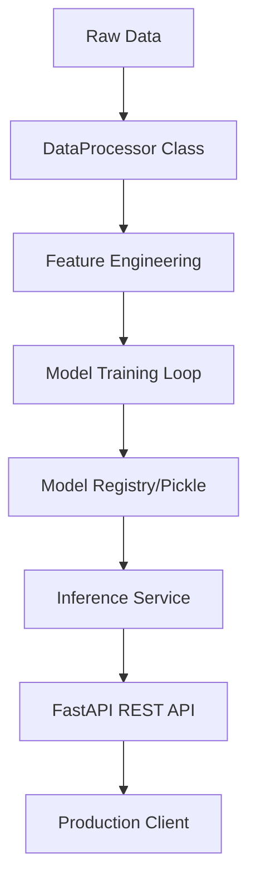

# 📈 Sales Forecasting Pipeline

A professional, modular, and production-ready machine learning pipeline for predicting 8 weeks of beverage sales across 43 US States.

## 🚀 Overview
This project implements an end-to-end forecasting system that automatically selects the best-performing model for each state. It features a high-performance FastAPI backend designed for real-world deployment.

### Key Features
*   **Multi-Model Engine**: Evaluates **SARIMA**, **Prophet**, **XGBoost**, and **LSTM** for every state.
*   **Best Model Selection**: Automatically routes prediction requests to the model with the lowest RMSE.
*   **Production API**: FastAPI implementation with request IDs, structured logging, caching, and rate limiting.
*   **Modular Architecture**: Clean separation of data generation, preprocessing, feature engineering, and training.
*   **Full Observability**: Integrated MLflow tracking and JSON-formatted logging.

---

## 🛠️ Architecture


---

## 📂 Project Structure
*   `data/`: Raw and processed sales data.
*   `src/`: Core logic (preprocessing, feature engineering, training, prediction).
*   `api/`: FastAPI application and production-grade middlewares.
*   `models/`: Saved model artifacts (.pkl, .keras).
*   `notebooks/`: Exploratory Data Analysis (EDA).

---

## 🚦 Getting Started

### 1. Installation
```bash
python -m venv venv
source venv/bin/activate  # Windows: venv\Scripts\activate
pip install -r requirements.txt
```

### 2. Training Pipeline
Run the trainers to generate the models:
```bash
python src/train_sarima.py
python src/train_prophet.py
python src/train_xgboost.py
python src/train_lstm.py
python src/evaluate_models.py
```

### 3. Launching the API
```bash
uvicorn api.app:app --reload
```

---

## 📡 API Endpoints

[Explore Interactive API Documentation](http://127.0.0.1:8000/docs)

| Method | Endpoint | Description |
| :--- | :--- | :--- |
| `GET` | `/health` | Liveness probe (Process check) |
| `GET` | `/ready` | Readiness probe (Model check) |
| `GET` | `/api/v1/forecast/{state}` | Returns 8-week forecast for a state |
| `GET` | `/api/v1/states` | List all 43 available states |
| `GET` | `/api/v1/model-info` | Current best model metadata |

---

## 🐳 Docker Deployment
Build and run the containerized service:
```bash
docker build -t sales-forecasting .
docker run -p 8000:8000 sales-forecasting
```

---

## 📊 Model Inference Visualization

*Example of an 8-week forecast for Texas using the XGBoost engine.*

---

## 🛡️ Backend Features
*   **Caching**: Results are cached with TTL to reduce inference latency.
*   **Rate Limiting**: Sliding window protection against API abuse.
*   **Tracing**: Unique `X-Request-ID` headers for end-to-end request tracking.
*   **Logging**: Structured JSON logs ready for ELK/CloudWatch integration.

---
**Author**: Nancy Singh
**Version**: 1.0.0
